# Jenkins Integration with Nexus

## Prerequisites
* Java version 1.8.0_221
* Git version 2.23.0
* Apache Maven 3.6.0
* Jenkins version 2.176.3
* Nexus version 2.14.16-01

### 1.- Create Jenkins Freestyle Project 

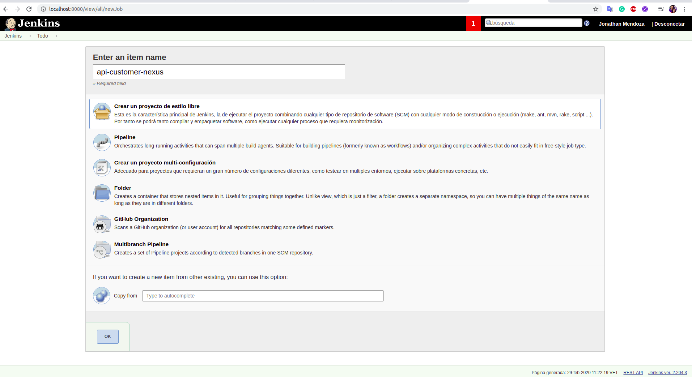

Specify GIT repository

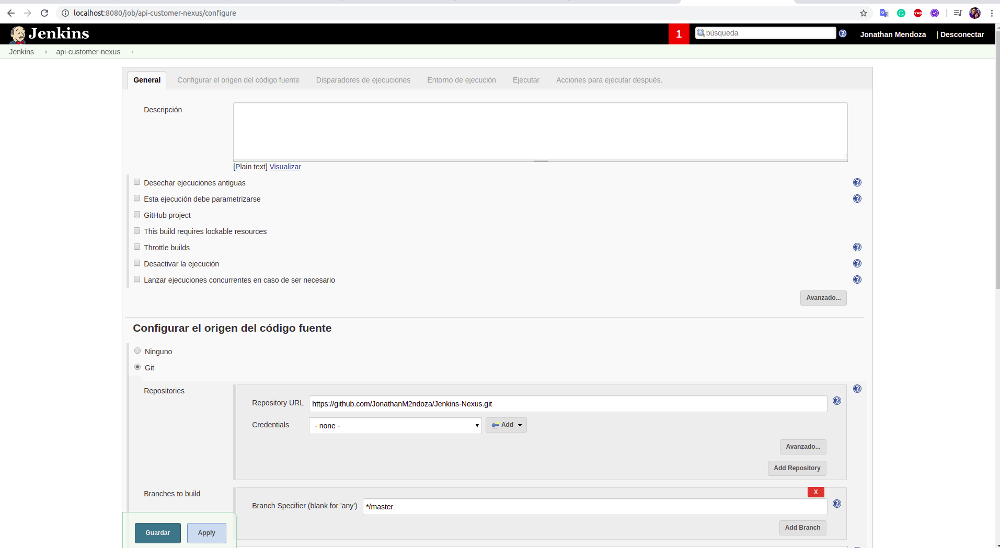

Set up Maven tasks

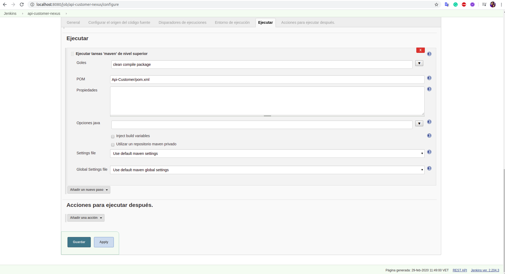

Build Project

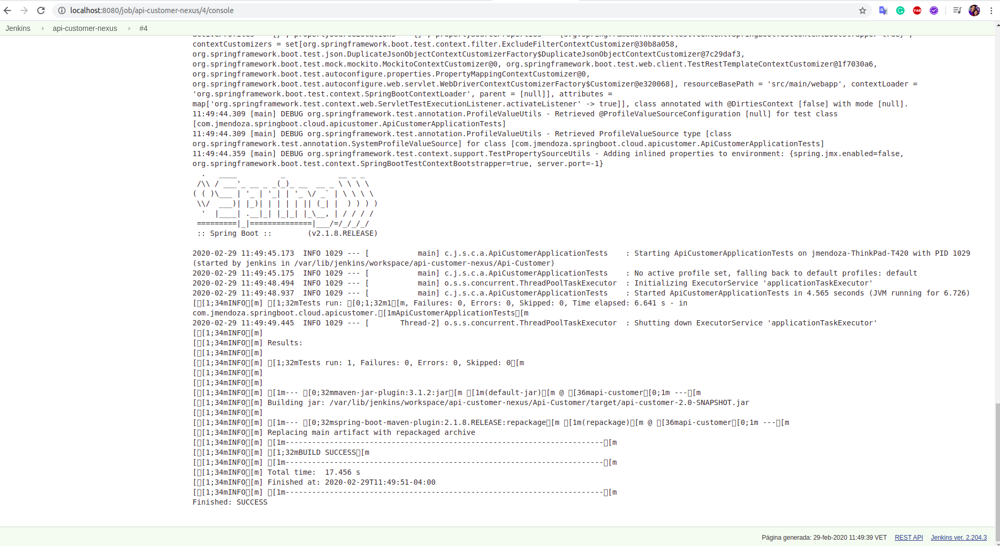

pom.xml file

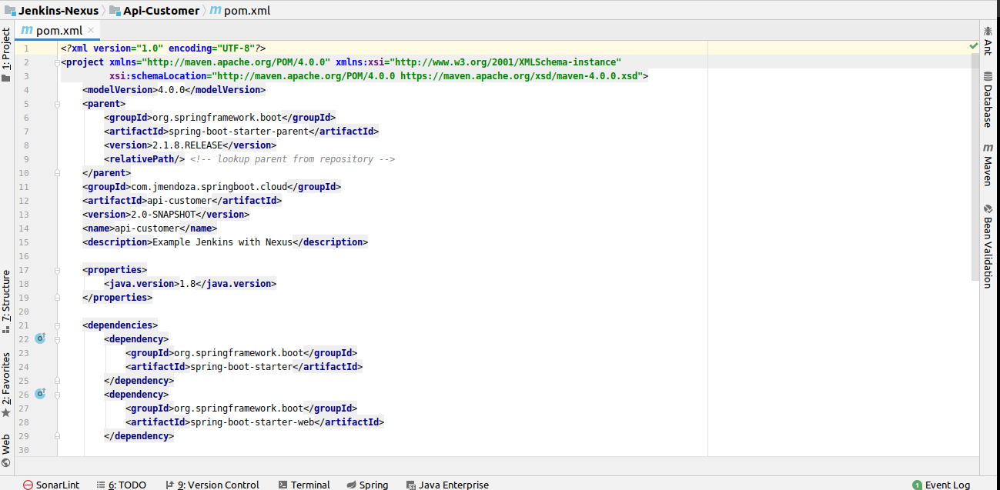

### 2.- Create Nexus Repository 

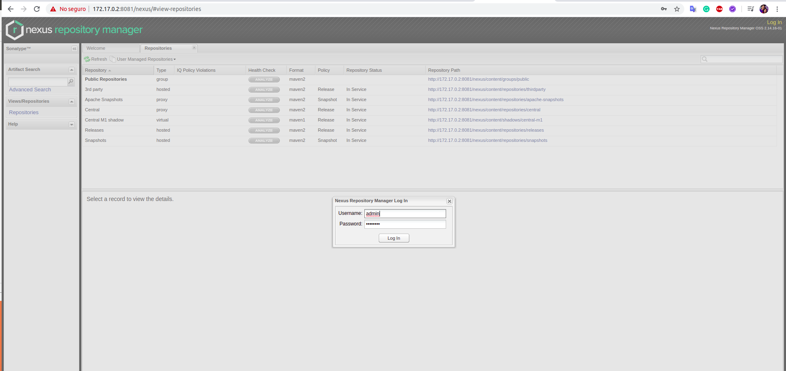

Hosted (Maven2)

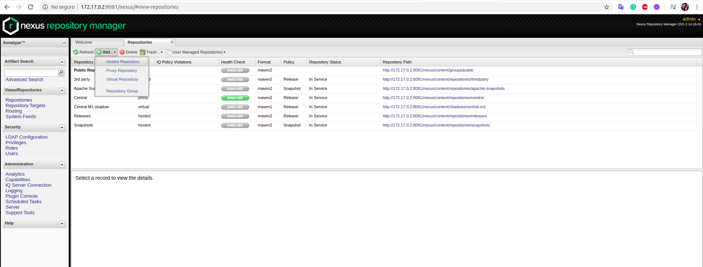

Create Repository Snapshot

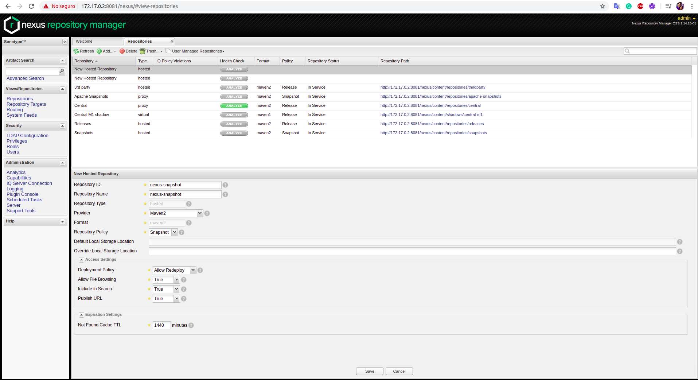

Create Repository Release

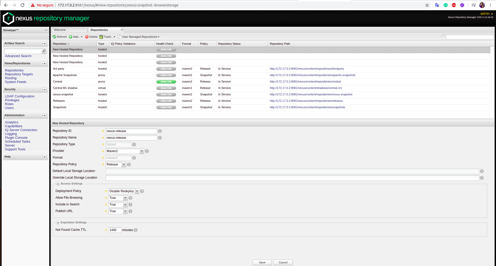

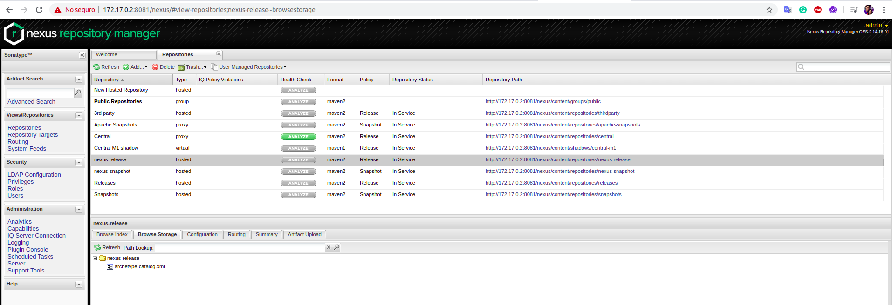

### 3.- Update pom.xml file with Repository Snapshot and Repository Release

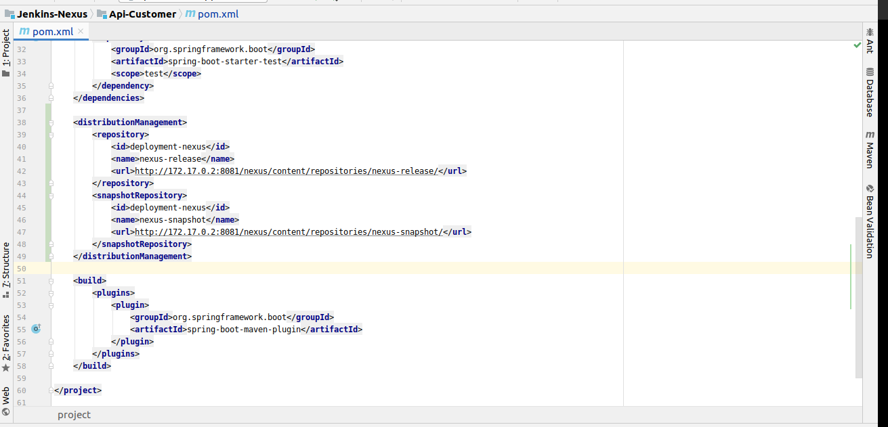

### 4.- Update settings.xml file in /var/lib/jenkins/.m2/ with nexus credentials

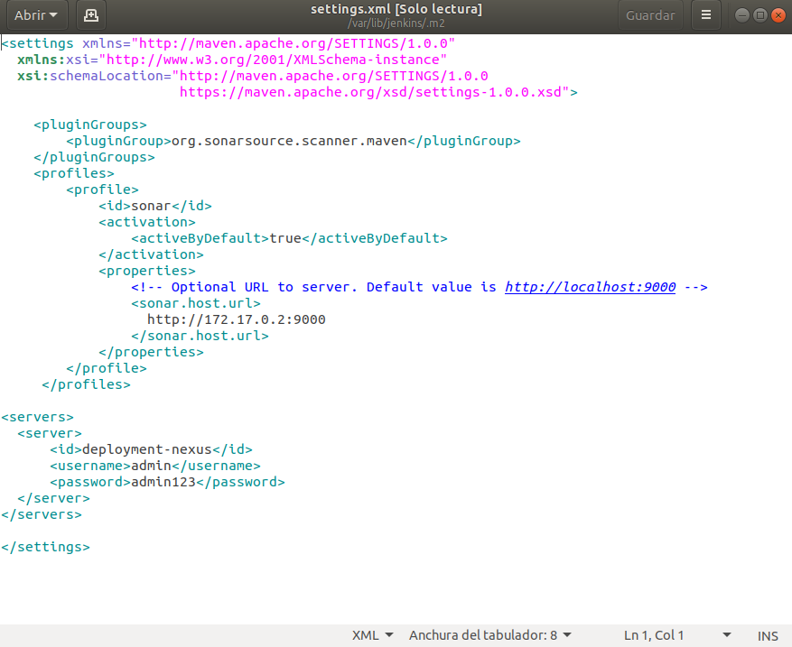

### 5.- Add task deploy Maven in Jenkins (Goals)

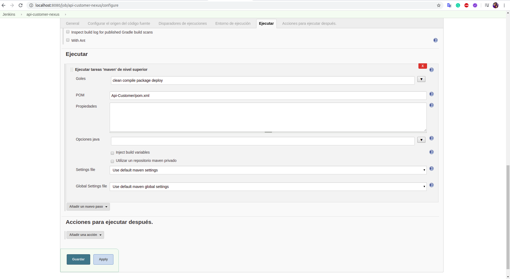

Build Project in Jenkins

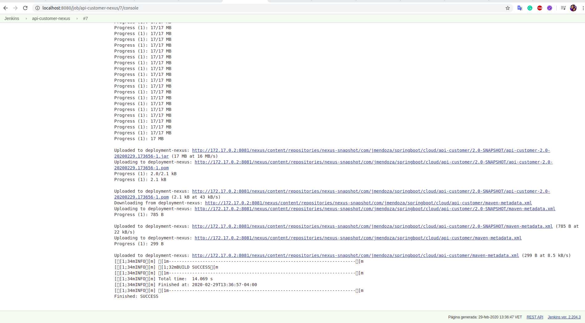

See the file api-customer-2.0-SNAPSHOT.jar in Nexus
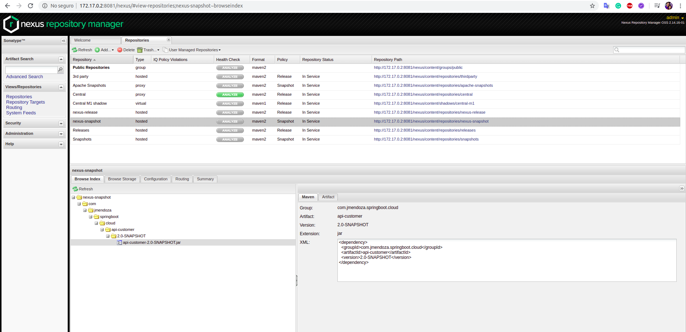

